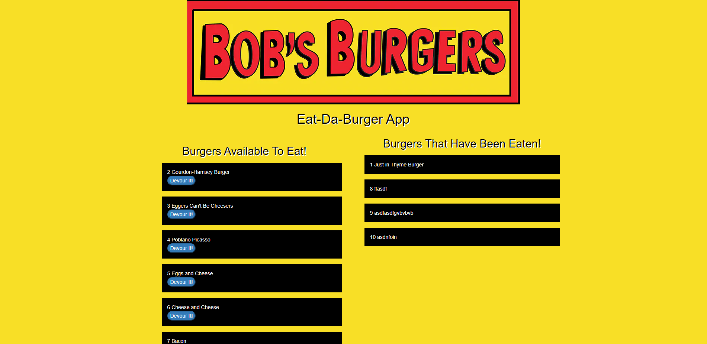

# burger

## Purpose:
With this app, you can place an order of the type of burger the user may want. Also, it will visually keep track on burgers on order and burgers that have been consume. This also writes it to mysql Database. 

## Use:
This app uses express, handlebars, and mysql.

### Commits:
First: The app is overall working. I would still want to tweak the CSS code. I would also want to add more functionality to it.

